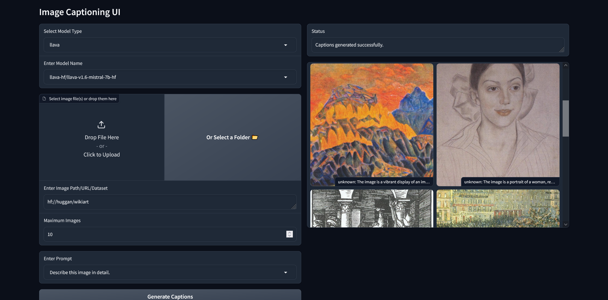
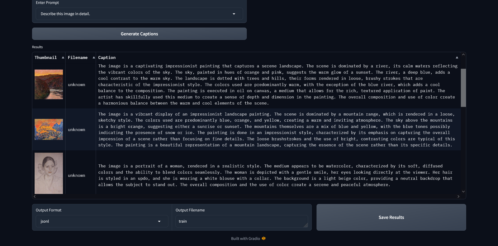

# Image Captioning Script

This script allows you to generate or try out captions for images using various AI models, and save the results to various output formats.

It supports a CLI mode, loading from config files, and a UI mode.




## Supported Models

The currently supported models are:

- BLIP-2
- COGVLM (Linux only, not tested)
- Dolphin (Not currently working)
- Florence-2
- InternVL2
- LLaVA
- Moondream
- WD Tagger

## Output

The script generates captions for the input images and saves the results in the specified output format (CSV, TSV or JSONL). The output includes the file name, URL (if applicable), prompt, and generated caption for each image-prompt combination.

## Setup

1. Clone this repository:
```shell
   git clone https://github.com/CheesyLaZanya/Custom-Captioning.git
   cd custom-captioning
```

2. Create a virtual environment and activate it:
```PowerShell
python -m venv .env
# source .env/bin/activate
.\.env\Scripts\Activate.ps1
```

3. Upgrade pip:
```shell
python -m pip install --upgrade pip
```

4. Install CUDA (if not already installed):
   - Download and install CUDA 12.1.1 from [NVIDIA's website](https://developer.nvidia.com/cuda-12-1-1-download-archive)

5. Install PyTorch with CUDA support:
```shell
pip3 install torch==2.3.1+cu121 torchvision==0.18.1+cu121 --index-url https://download.pytorch.org/whl/cu121
```

6. Upgrade wheel:
```shell
pip install -U wheel
```

7. Install the required packages:
```shell
# Comment out flash-attn==2.6.1 first on Linux or if not using Florence2
pip install -r requirements.txt
```

8. Install the pre-commit hooks:
```shell
pre-commit install
```

9. On certain Linux systems you may also need:
```shell
sudo pacman -S tk
pip install tk==0.1.0
```

## Usage

The script has the following options available:

```shell
python main.py --model_name MODEL_NAME --model_type MODEL_TYPE --image_input IMAGE_INPUT --maximum_images MAXIMUM_IMAGES --prompt PROMPT --prompt_file PROMPT_FILE --output_format OUTPUT_FORMAT --output_file OUTPUT_FILE --debug --ui -config CONFIG_PATH
```

Arguments:
- `--model_name`: Name or path of the model (optional)
- `--model_type`: Type of the model (choices: llava, blip2, florence2, dolphin) (optional)
- `--image_input`: Image URL, Hugging Face dataset (precedded by hf://), or local path (optional)
- `--maximum_images`: The maximum number of images to process (optional)
- `--prompt`: Single prompt for captioning (optional)
- `--prompt_file`: File containing multiple prompts (optional)
- `--output_format`: Output format (choices: csv, tsv, jsonl) (optional)
- `--output_file`: Output file name (optional)
- `--debug`: Enable debug output in Gradio interface (optional)
- `--ui`: Run in the basic UI mode with Gradio interface (optional)

Examples:

Running UI Mode
```shell
.\main.py --ui
```

Running via CLI Mode:

```shell
# LLava
.\main.py --model_name "llava-hf/llava-v1.6-mistral-7b-hf" --model_type llava --image_input "https://upload.wikimedia.org/wikipedia/en/thumb/8/80/Wikipedia-logo-v2.svg/1200px-Wikipedia-logo-v2.svg.png" --prompt "Describe this image in detail" --output_format csv --output_file llava.csv --debug
```

Running via Config Mode:

```shell
.\main.py --config "configs/moondream_run.yml"
```


Other Examples:

```shell
# Florence2
.\main.py --model_name "microsoft/Florence-2-large-ft" --model_type 'florence2' --image_input "https://media.newyorker.com/cartoons/63dc6847be24a6a76d90eb99/master/w_1160,c_limit/230213_a26611_838.jpg" --prompt "<CAPTION>" --output_format csv --output_file florence2.csv

# Prompt File
.\main.py --model_name "microsoft/Florence-2-large-ft" --model_type 'florence2' --image_input "https://media.newyorker.com/cartoons/63dc6847be24a6a76d90eb99/master/w_1160,c_limit/230213_a26611_838.jpg" --prompt_file "florence2_prompts.txt" --output_format csv --output_file florence2_multi_prompt.csv

# Local File
.\main.py --model_name "microsoft/Florence-2-large-ft" --model_type 'florence2' --image_input "E:/EImageAI/Datasets/r_cosplay/I cosplayed Megumin.jpg" --prompt_file "florence2_prompts.txt" --output_format csv --output_file florence2_local_image.csv

# Local Directory
.\main.py --model_name "microsoft/Florence-2-large-ft" --model_type 'florence2' --image_input "E:/EImageAI/Datasets/r_cosplay/" --prompt_file "florence2_prompts.txt" --output_format csv --output_file florence2_local_folder.csv
```

```shell
# Blip2
.\main.py --model_name "Salesforce/blip2-opt-2.7b" --model_type blip2 --image_input "https://media.newyorker.com/cartoons/63dc6847be24a6a76d90eb99/master/w_1160,c_limit/230213_a26611_838.jpg" --prompt "What is the art style?" --output_format csv --output_file blip2.csv
```

```shell
# Dolphin
.\main.py --model_name "cognitivecomputations/dolphin-vision-7b" --model_type dolphin --image_input "https://media.newyorker.com/cartoons/63dc6847be24a6a76d90eb99/master/w_1160,c_limit/230213_a26611_838.jpg" --prompt "Describe this image in detail" --output_format csv --output_file dolphin.csv

# Currently fails with
# ValueError: The checkpoint you are trying to load has model type `bunny-qwen` but Transformers does not recognize this architecture. This could be because of an issue with the checkpoint, or because your version of Transformers is out of date.

```

## Troubleshooting

If you encounter any issues with CUDA or GPU support, ensure that:
1. You have a compatible NVIDIA GPU.
2. You have installed the correct CUDA version (12.1.1 recommended).
3. Your system PATH includes the CUDA installation directory.

For model-specific issues, refer to the documentation of the respective model repositories.

## Linting

```shell
flake8 .
```
